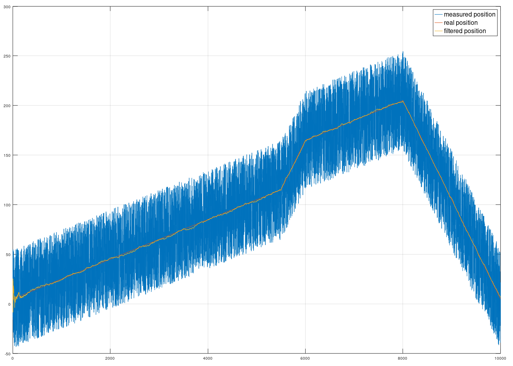

# Example of kalman filtering 

System tracks target in linear motion. It has two identical sensors which produce measured noisy position. Kalman filter
fuses sensor data to one position estimate.

